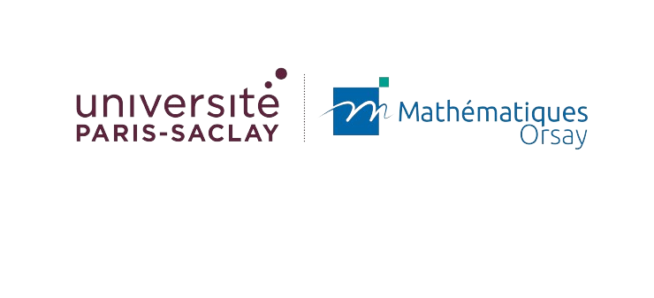

# Online Learning, Links with Optimization and Games: Final Project

**Solving games: extrapolation vs optimism**

  

**Alex Pierron**

*Paris-Saclay University / Mathematical Institute of Orsay, M2 Mathematics & AI, 2023-2024*

[Course Website](https://joon-kwon.github.io/regret-ups/) 

---

## Description

In this final project for the Online Learning class, we study the problem of solving games using extrapolation and optimism techniques. We first establish some initial theoretical properties and expressions for the subdifferential of the entropic regularizer. We then introduce a new regularizer based on the entropic regularizer and prove that it is a regularizer on the product of simplices. Finally, we analyze the UMP iterates with this new regularizer and derive a guarantee.

## Numerical experiments and comparison

We conduct numerical experiments to compare the performance of the proposed algorithm with other algorithms seen in the course. The experiments are conducted exclusively on two-player zero-sum games and the proposed algorithm is compared to the exponential weights, RM and RM+ algorithms. The code and affiliated notebook are available in the `Pierron_algorithms.py` script and `Pierron_experiments.ipynb` notebook, respectively.

## Required Libraries
This project requires the following Python libraries:
- numpy
- matplotlib
- tqdm
- itertools

## Acknowledgments

This project was completed as part of the course "Online learning, links with optimization and games" class, 2023-2024 given by [J. Kwon](https://joon-kwon.github.io/).
